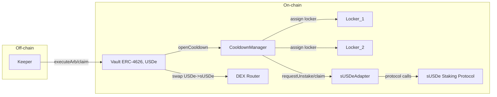
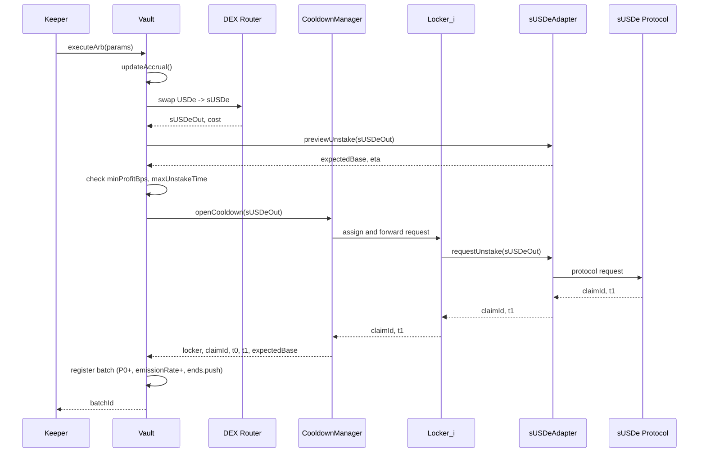

MVP: Immediate Unstaking Arbitrage (sUSDe‑only)

Коротко: MVP реализует один Vault для USDe⇄sUSDe арбитража с линейной амортизацией прибыли, очередью выводов R и пулом локеров через CooldownManager. Плагинная система упрощена: поддерживается только один адаптер стейкинга (sUSDe); своп выполняется прямым вызовом роутера (без slippage‑чеков) с он‑чейн проверкой прибыли после свопа (весь tx откатывается, если профит ниже порога).

1) Область и допущения (MVP)

- **Актив**: только sUSDe (базовый актив — USDe).
- **Своп**: прямой вызов whitelisted DEX‑роутера из Vault по calldata кипера; без он‑чейн slippage‑чеков, транзакция полностью откатывается, если пост‑своп проверка прибыли не проходит.
- **Staking‑протокол**: один адаптер sUSDe с функциями preview/requestUnstake/claim.
- **Локеры**: пул суб‑адресов управляется CooldownManager (каждый держит не более одного активного батча).
- **Accrual**: линейная амортизация прибыли через агрегаты `emissionRate`, `accruedGain`, `lastUpdate`, `ends[]`.
- **Выводы**: немедленно при наличии C, иначе постановка в очередь R (FIFO).
- **Комиссии**: perf‑fee (по умолчанию), mgmt‑fee = 0 (для MVP можно выключить).
- **Без оракулов**: NAV детерминирован из on‑chain величин (cost/mature/время).
- **Роли**: Admin (параметры/паузa), Keeper (execute/claim), пользователь (ERC‑4626 операции).
 - **Сеть развертывания**: Ethereum Mainnet.
 - **Адреса токенов (Ethereum Mainnet)**:
   - USDe: [0x4c9edd5852cd905f086c759e8383e09bff1e68b3](https://etherscan.io/token/0x4c9edd5852cd905f086c759e8383e09bff1e68b3)
   - sUSDe: [0x9D39A5DE30e57443BfF2A8307A4256c8797A3497](https://etherscan.io/token/0x9D39A5DE30e57443BfF2A8307A4256c8797A3497)
 - **RPC‑эндпоинты (Ethereum Mainnet)**:
   - [https://rarible.com/nodes/ethereum-node](https://rarible.com/nodes/ethereum-node)
   - [https://eth.llamarpc.com](https://eth.llamarpc.com)
   - [https://ethereum-rpc.publicnode.com](https://ethereum-rpc.publicnode.com)
   - [https://eth.drpc.org](https://eth.drpc.org)
   - [https://ethereum-json-rpc.stakely.io](https://ethereum-json-rpc.stakely.io)

2) Архитектура компонентов (он‑чейн)

- **Vault (ERC‑4626, базовый актив USDe)**
  - Учёт NAV: NAV = C + P0 + G(t) − R.
  - Accrual: `updateAccrual()` поддерживает `accruedGain` и `emissionRate`.
  - Управление батчами: `executeArb` (своп → cooldown), `claimBatch`.
  - Очередь выводов: `requestWithdraw`, погашение R при поступлениях.
  - Верификация прибыли/сроков до исполнения.

- **CooldownManager**
  - Пул локеров (минимальные прокси/EOA). Назначает свободный локер под новый батч.
  - Маршрутизирует вызовы к адаптеру стейкинга (request/claim) от имени локера.
  - Гарантирует изоляцию: 1 батч на локер, защита от повторного запуска.

- **sUSDeAdapter**
  - Инкапсулирует интеграцию с протоколом sUSDe: превью и запуск анстейка, клейм.
  - Возвращает `expectedMature` и ETA (секунды) для верификации контракта Vault.

- **DEX Router (внешний контракт)**
  - Вызывается напрямую из Vault по предоставленному calldata (без адаптера и без slippage‑чеков на уровне контракта).

3) Компонентная диаграмма (MVP)



4) Основные последовательности

4.1. Открытие сделки (executeArb)



4.2. Клейм батча (claimBatch)

```mermaid
sequenceDiagram
  participant K as Keeper
  participant V as Vault
  participant CM as CooldownManager
  participant L as Locker_i
  participant A as sUSDeAdapter
  participant SP as sUSDe Protocol

  K->>V: claimBatch(batchId)
  V->>V: updateAccrual() \n(emissionRate авто снижена по t1)
  V->>CM: claim(batchId)
  CM->>L: claim(claimId)
  L->>A: claim(claimId, receiver=Vault)
  A->>SP: claim
  SP-->>A: amountBaseReceived
  A-->>L: amountBaseReceived
  L-->>CM: amountBaseReceived
  CM-->>V: amountBaseReceived
  Note right of V: C += mature;\nP0 -= cost;\nгасятся R (FIFO);\nостаток в C
  V-->>K: Claimed(amount)
```


4.3. Вывод с очередью (requestWithdraw)

```mermaid
sequenceDiagram
  participant U as LP User
  participant V as Vault

  U->>V: requestWithdraw(shares)
  V->>V: updateAccrual(); calc PPS
  V->>U: pay min(C, owed)
  V->>V: if C<owed => R += (owed - paid), burn shares
  Note over V: При поступлениях: сначала гасим R (FIFO), затем остаток -> C
```

5) Состояния и учёт (MVP)

- **Переменные**: `C`, `P0`, `accruedGain`, `emissionRate`, `lastUpdate`, `R`.
- **Батч**: `{ cost, mature, t0, t1, rate, locker, claimId }`.
- **Очередь окончаний**: `ends[] = (t1, rate)`; при `now>=t1` уменьшаем `emissionRate`.
- **NAV/PPS**: см. формулы в design.md; PPS растёт плавно.

6) Параметры и роли (по умолчанию)

- **minProfitBps**: 15–30 б.п.
- **maxUnstakeTime**: 10 дней.
- **depositCap**: лимит TVL.
- **perfFeeBps**: 10–15% (включаем/выключаем минтом долей).
- **Роли**: Admin (параметры/пауза), Keeper (execute/claim), LP (ERC‑4626).

7) Инварианты и безопасность (MVP)

- NAV консистентность: `NAV = C + P0 + accruedGain − R` после `updateAccrual()`.
- Защита прибыли: `gain >= minProfitBps * cost / 10000` и `eta <= maxUnstakeTime`.
- Очередь R: FIFO; при поступлениях сначала гасятся обязательства.
- Изоляция локеров: 1 активный батч на локер.
- Reentrancy‑guard на мутирующих функциях; белые списки адаптеров/роутеров; пауза.

8) Публичные интерфейсы (контракты интеграции)

8.1. Vault (ключевые дополнения к ERC‑4626)

```solidity
// SPDX-License-Identifier: MIT
pragma solidity ^0.8.24;

interface IVaultMvp {
    struct ExecuteArbParams {
        uint256 baseAmountIn;        // USDe, сколько тратим на своп
        address router;              // адрес DEX-роутера
        bytes swapCalldata;          // calldata для low-level вызова роутера
        uint256 minProfitBps;        // он-чэйн проверка прибыли (опционально переопределяет глобальный порог)
        uint256 maxUnstakeTime;      // он-чэйн проверка ETA (может быть 0 -> использовать глобальный)
    }

    function executeArb(ExecuteArbParams calldata p) external returns (uint256 batchId);

    function claimBatch(uint256 batchId) external returns (uint256 amountBaseReceived);

    // Упрощённая очередь выводов для MVP
    function requestWithdraw(uint256 shares) external;

    // View
    function nav() external view returns (uint256);
    function pps() external view returns (uint256);
}
```

8.2. CooldownManager

```solidity
// SPDX-License-Identifier: MIT
pragma solidity ^0.8.24;

interface ICooldownManager {
    struct OpenCooldownResult {
        uint256 batchId;
        address locker;
        bytes32 claimId;
        uint64 t0;
        uint64 t1;
        uint256 expectedBase;
    }

    function openCooldown(uint256 amountStake, bytes calldata extraData)
        external
        returns (OpenCooldownResult memory res);

    function claim(uint256 batchId) external returns (uint256 amountBaseReceived);

    function nextFreeLocker() external view returns (address);
}
```

8.3. sUSDeAdapter

```solidity
// SPDX-License-Identifier: MIT
pragma solidity ^0.8.24;

interface ISUSDeAdapter {
    function baseAsset() external view returns (address);   // USDe
    function stakeToken() external view returns (address);  // sUSDe

    function previewUnstake(uint256 amountStake)
        external
        view
        returns (uint256 amountBase, uint256 etaSeconds);

    function requestUnstake(address locker, uint256 amountStake)
        external
        returns (bytes32 claimId, uint64 t1, uint256 expectedBase);

    function claim(address locker, bytes32 claimId, address receiver)
        external
        returns (uint256 amountBaseReceived);
}
```

9) События (ключевые для мониторинга)

- `BatchOpened(batchId, locker, cost, expectedMature, gain, t0, t1, rate)`
- `BatchMatured(batchId, locker, actualReceived)`
- `AccrualUpdated(accruedGain, emissionRate, timestamp)`
- `WithdrawQueued(user, shares, owed, paidNow, queuedAmount)`
- `WithdrawPaidFromQueue(user, amount)`
- `FeesTaken(feeAmount, sharesMinted, feeRecipient)`
- `ParametersUpdated(...)`, `Paused()`, `Unpaused()`

10) Acceptance (минимум для MVP)

- Один полный цикл батча: execute → амортизация → claim, без скачков PPS.
- Очередь выводов: частичная выплата и погашение R при клеймах.
- Он‑чейн проверка прибыли/ETA; при недостаточной прибыли — полный revert (включая своп).
- Изоляция локеров: новый батч всегда на свободном локере.
- Метрики: `nav()`, `pps()`, `accruedGain`, `emissionRate`, размер R, число активных батчей.

11) Замечания к реализации (MVP)

- `updateAccrual()` вызывать в каждой мутирующей функции Vault и перед расчётами PPS/NAV.
- `ends[]` хранить как min‑heap либо отсортированную очередь по `t1` (MVP: простая очередь + обработка нескольких окончаний за вызов).
- `perfFee` брать из `accruedGain` при `updateAccrual()` через минт долей на `feeRecipient` (или отключить в MVP).
- DEX‑свопы — raw вызов whitelisted роутера по calldata кипера; весь tx откатывается, если пост‑своп проверка прибыли не проходит.

Приложение: формулы и определения см. в `docs/design.md` (разделы 5, 7–10, 12, 14–17).


